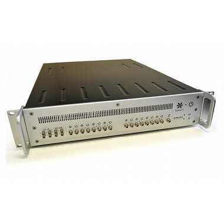

.. _camera-xspress3:

Xspress3
-------



Introduction
````````````
Many solid state detectors are not limited by their intrinsic rate capability, but by the readout system connected to them.
The Quantum Detectors Xspress 3 was developed to maximise the throughput and resolution of such detectors and remove the bottleneck
at the readout stage. With output count rates of over 3 Mcps, this detector is easily 10X faster than the systems many users have
on their beamlines. Xspress 3 can open up the beamline to much faster data collection, its dynamic range can reduce the number of
scans required and save large amounts of time with attenuation selection.

The XSPRESS3 system contains a Xilinx Virtex-5 FPGA with two embedded PowerPC processors. PPC1 manages the DMA engines.
PPC2 runs the Xilinx micro kernel and communicates to the Intel 64 bit Linux server PC by 1 GBit Ethernet,TCP sockets.
Bulk data and event lists to be histogrammed are sent from the firmware to the Server PC by 10G Ethernet, UDP.

The Software Development Toolkit (SDK) is provided for Linux only.

Prerequisite
````````````
Unpack the SDK distribution into either the camera/xspress3/sdk directory or /usr/local/lib
Then ensure the libraries are in the LD_LIBRARY_PATH

The SDK has shared libraries which has been compiled on recent linux kernel. g++ (GCC) 4.1.2 20080704 (Red Hat 4.1.2-50),
 check first you have the right kernel and libc available by compiling the test program.

The default network setup is (excluding the site network connection):

1GBit Copper network for control communinication between the PC and the XSPRESS3 box.
With more than 1 XSPRESS3 box connected this network uses a ethernet switch
A private network with 64 addresses allocated:
eth1     Link encap:Ethernet  HWaddr d4:ae:52:7d:5f:84
         inet addr:192.168.0.1  Bcast:192.168.0.63  Mask:255.255.255.192
         inet6 addr: fe80::d6ae:52ff:fe7d:5f84/64 Scope:Link
         UP BROADCAST RUNNING MULTICAST  MTU:9000  Metric:1
         RX packets:1567 errors:0 dropped:5766 overruns:0 frame:0
         TX packets:158 errors:0 dropped:0 overruns:0 carrier:0
         collisions:0 txqueuelen:1000
         RX bytes:173937 (169.8 KiB)  TX bytes:37252 (36.3 KiB)
         Interrupt:48 Memory:da000000-da012800
 
A 10GBit Fibre network for data transfer, point to point with 4 addresses allocated.
With more that 1 XSPRESS3 box there would be multiple 10G Ports on the PC with multiple 4 address range subnets

ifconfig eth2
eth2     Link encap:Ethernet  HWaddr 00:07:43:05:7c:65
         inet addr:192.168.0.65  Bcast:192.168.0.67  Mask:255.255.255.252
         inet6 addr: fe80::207:43ff:fe05:7c65/64 Scope:Link
         UP BROADCAST RUNNING MULTICAST  MTU:9000  Metric:1
         RX packets:0 errors:0 dropped:0 overruns:0 frame:0
         TX packets:702 errors:0 dropped:0 overruns:0 carrier:0
         collisions:0 txqueuelen:1000
         RX bytes:0 (0.0 B)  TX bytes:154963 (151.3 KiB)
         Interrupt:41 Memory:dd7fe000-dd7fefff

Note the carefully picked subnet masks etc and the MTU 9000
We then have a script that should be executed automatically at boot.

cat /etc/init.d/xspress3.sh

.. code-block:: sh

  #!/bin/bash
  #
  # static-arp        This is to register a static ARP address in the arp table at boot
  #
  # Kept as simple as possible hopefully this will auto register the associated
  # MAC with the private network address to allow the machine to communicate with the
  # test boards for xspress3
  # Derived from work by Duncan Russell, by William Helsby
  PATH=/sbin:/bin:/usr/bin:/usr/sbin
  arp -i eth2 -s 192.168.0.66 02:00:00:00:00:00
  #route -v add -host 192.168.0.66 eth2
  # Setting default and max buffer sizes for networking.
  sysctl -w net.core.rmem_max=1073741824
  sysctl -w net.core.rmem_default=1073741824

Installation & Module configuration
````````````````````````````````````

-  follow first the steps for the linux installation :ref:`linux_installation`

The minimum configuration file is *config.inc* :

.. code-block:: sh

  COMPILE_CORE=1
  COMPILE_SIMULATOR=0
  COMPILE_SPS_IMAGE=1
  COMPILE_XSPRESS3=1
  export COMPILE_CORE COMPILE_SPS_IMAGE COMPILE_SIMULATOR COMPILE_XSPRESS3

-  start the compilation :ref:`linux_compilation`

-  finally for the Tango server installation :ref:`tango_installation`

Initialisation and Capabilities
````````````````````````````````
In order to help people to understand how the camera plugin has been implemented in LImA this section
provide some important information about the developer's choices.

Camera initialisation
......................

The camera will be initialized within the Xspress3Camera object. A TCP socket connection on the 1GBit port is established and
optionally a UDP connection on the 10Gbit port (depends on boolean constructor flag noUDP). The ROI's are reset, the first
card in a multicard system or the single card, is set to be the master and the run flags are set to initiate Scaler and Histogram modes.
The register and configuration settings (as optimised by QD on delivery) are uploaded to the Xspress3.

The Xspress3 requires the following parameters with the recommended settings.
nbCards           = 1 (number of Xspress3 boxes)
maxFrames         = 16384
baseIPaddress     = "192.168.0.1"
basePort          = 30123
baseMACaddress    = "02.00.00.00.00.00"
nbChans           = 4/6/8 (depends on the firmware)
createScopeModule = true/false
scopeModuleName   = "a-name-of-your-choice"
debug             = 0 is off, 1 is on, 2 is verbose
cardIndex         = 0 (for a 1 xspress system)
noUDP             = true/false
directoryName     = "directory containing xspress3 configuration settings"

The Xspress3Camera contructor sets the camera with default parameters for Number of Pixels (4096), the imageType (Bpp32),
Number of Frames (1) and the trigger mode (IntTrig)

Std capabilites
................

This plugin has been implemented with respect of the mandatory capabilites but with some limitations which
are due to the camera and SDK features.  We only provide here extra information for a better understanding
of the capabilities for Xspress3 cameras.

* HwDetInfo
  
  getCurrImageType/getDefImageType(): is set to Bpp32
  setCurrImageType(): will not change the image type.
  getMaxImageSize/getDetectorImageSize(): is defined as number of pixels + number of scalers x number of channels. 
                                          i.e. (4096+8) x 4 for a 4 channel xspress3 system
  getPixelSize(): is hardcoded to be 1x1
  getDetectorModel(): reads and reports the xspress3 firmware version.

* HwSync

  get/setTrigMode(): the only supported modes are IntTrig, ExtGate and IntTrigMult
  

Optional capabilities
........................
None

Data Format
```````````

The raw data is saved in .edf file format. Each frame is saved as it completes. To allow Lima to save both
histogram and scaler data, the latter is appended to the histogram data.
         histogram      scaler
    [0] [0 ... 4095, 4096 ... 5003]               channel 0
    [1] [0 ... 4095, 4096 ... 5003]               channel 1
    [2] [0 ... 4095, 4096 ... 5003]               channel 2
    [3] [0 ... 4095, 4096 ... 5003]               channel 3

	Camera::readScalers(): returns the raw scaler data from the Lima buffers from the specified frame and channel
	Camera::readHistogram(): returns the raw histogram data from the Lima buffers from the specified frame and channel
	setUseDtc/getUseDtc(): set to true will dead time correct the data returned from the Lima buffers (default is false)
	setUseHW/getUseHw(): set to true will return raw histogram data from the H/W data buffers, including the current frame.

How to use
````````````
See example in the test directory. Playback data should be extracted from the tarball.
